预编译头文件的作用是将大量稳定的头文件==提前编译成二进制缓存==。这样编译器在处理每个源文件时，直接读取该缓存，而无需重新解析成千上万行重复的代码，从而极大地缩短编译时间。  

> 比如常用的标准模版库：比如向量、字符串、标准输出之类，假设我们每次（在==每个`.cpp`文件==）都要包含vector，需要读取vector.h头文件并编译，而且vector本身也包含其他一系列头文件，所有其他头文件被复制到`vector.h`中，再把`vector.h`复制到`.cpp`中（大约十万行代码），还要进行解析和标记化，并以某种形式进行编译

- 如果项目中有多个cpp文件，很多地方都包括`vector.h`，他们会被逐个包含在每个文件中 ~~每个翻译单元（.cpp）都会被单独编译，然后链接器将它们链接起来~~  
- 且每次对那个cpp文件 ~~包含了vector.h的~~ 重新更改时，整个 ~~这里是说要把vector.h复制进来然后再编译~~ 都得重新编译

*建议*  

- 改用预编译头文件，它会获取一堆头文件（要包含的那些），然后它编译一次，并将起转换为二进制格式。这对编译器来说处理起来比纯文件快得多 ~~因为它以处于解析状态，而且是==二进制==文件，随时可以，不用再重新编译~~ 
	- 举个例子，可能本来要1分钟，使用预编译头文件后，编译可能只需8秒钟
- 预编译头文件其实就是一个头文件，且包含一系列其他头文件
	- 不可以把所有头文件都放进去，因为==如果一个头文件经常变化，那么每次改动都需要重新编译整个预编译头文件==
	- 不需要在项目的每个cpp都包含日志文件，只需要包含含有日志的==预编译头文件==
- C++库、标准模板库、WindowsAPI调用库，建议把这些都放进预编译头文件 ~~每次编译可能他的代码量比实际代码还多~~ 。这样就能从每个C++文件中获取所有内容，如果要用只能指针，就不用实际直接包含memory头文件，因为他在预编译头文件中，它会包含在实际编写的每个C++文件中
- 因为把所有文件都放进了`pch.h` ~~也可以叫其他名字~~ ，所以不能一眼看出实际include了什么，且`pch.h`中包含了所有的，所以也不清楚实际它==只依赖==哪些头文件
- 如果编写游戏引擎，可能只有一个cpp文件需要包含GLFW  ~~编译一起就搞定~~ ，那么可以把GLFW放入`pch.h`中，因为其他内容都被抽象放在自己的api中；而其他的标准库、vector、标准输入输出之类的，很多都会用的，也可以让它编译一次就搞定

# 例子

```cpp
//Main.cpp
#include "pch.h"

int main()
{
	std::cout << "Hello World!" << std::endl;
}
```

```cpp
//pch.h
#pragma once

#include <iostream>
#include <algorithm>
#include <functional>
#include <memory>
#include <thread>
#include <utility>

// Data structures
#include <string>
#include <stack>
#include <deque>
#include <array>
#include <vector>
#include <set>
#include <map>
#include <unordered_set>
#include <unordered_map>

//Windows API
#include <windows.h>


```

做个测试  

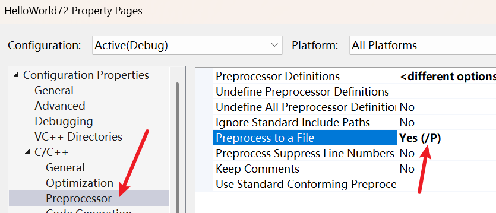  

然后ctrl+f7编译Main.cpp，查看生成的Main.i文件  

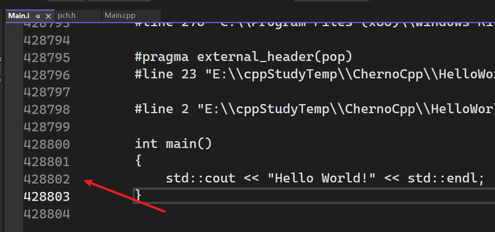  

- 由于pch.h中的源代码全都被拷贝到了Main.i中，所以该文件有40几万行代码  
- 每有cpp文件包含pch.h时，每次都会编译一次成这样的40几万行代码。使用预编译头文件避免这种情况

# 使用预编译头文件

## 目前文件夹树图

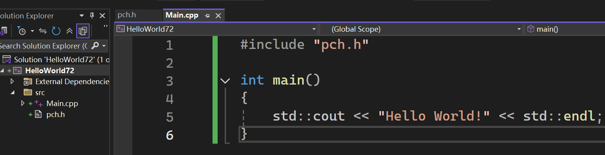  

两个文件

把上面的==预处理到文件关闭== ~~很重要！~~   

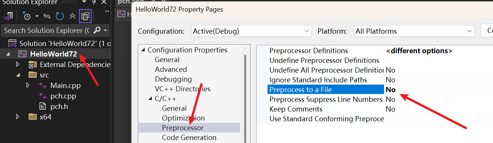 


## 改进

### pch.cpp

添加一个文件pch.cpp  

```cpp
//pch.cpp
#include "pch.h"
```

右键pch.cpp文件，属性（properties）  

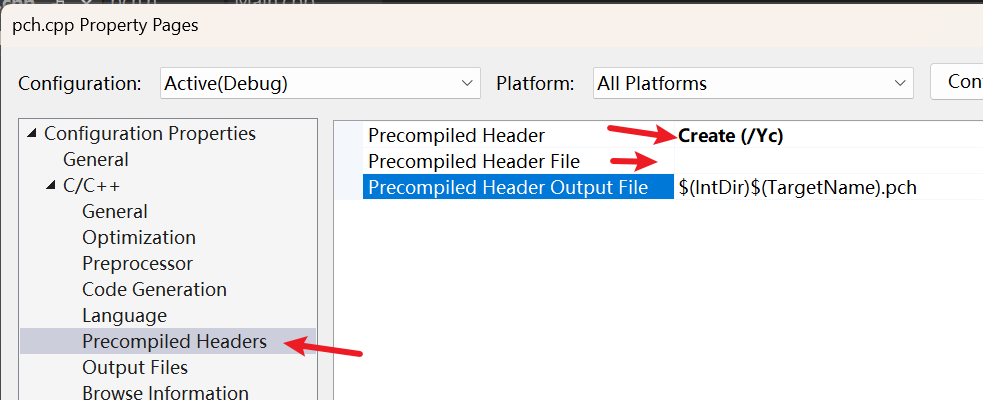  

当你设置 pch.cpp 为 Create (/Yc) 时，编译器会扫描这个源文件。它在寻找哪一行代码呢？就是你在框里填的那个名字。

- 触发开关：编译器一旦在 pch.cpp 中读到 `#include "pch.h"`，它就会意识到：“这就是我要预编译的终点！”然后它把`这一行之前的所有内容`全部打包成二进制 .pch 文件。如果在==这一行之后还有代码==（虽然 Cherno 建议不要写），那些代码不会进入 PCH 缓存，而是会==被当成普通的 C++ 代码编译进 pch.obj==。
- 留空的后果：如果你留空，编译器就不知道该把哪个头文件作为预编译的“分界线”，测试后发现会把==所有的内容==全部打包进二进制 .pch 文件
#### 验证

假设有文件pch.h和pch.cpp
```cpp
//文件名------pch.h

#pragma once
#include <iostream>
```

```cpp
//文件名------pch.cpp

//sdkfaksjdfk
#include "pch.h"

//Windows API
#include <windows.h>
```

- 设置precompiledHeaderFile为空时，ctrl+f7编译pch.cpp后，HelloWorld72.pch大小为61312KB
- 设置precompiledHeaderFile为`pch.h`时，ctrl+f7编译pch.cpp后，HelloWorld72.pch大小为42112KB


#### 注意
注意：这里一定要确保这个Preprocess to a file是No  

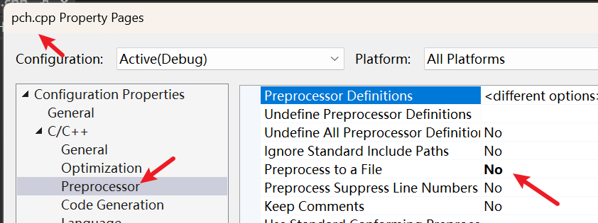

### 项目属性
确定后，右键项目-属性  

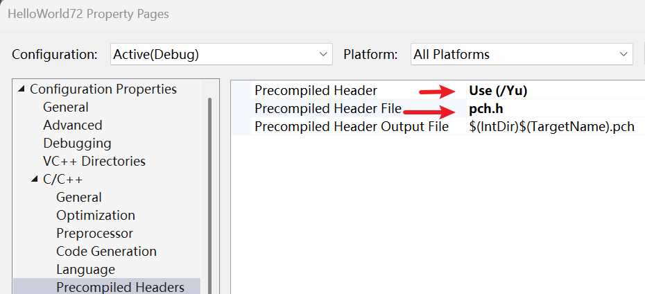  

> 
> 含义：编译器在编译其他源文件时，一看到 `#include "你填在框里的名字"`。
> 
> 动作：它会直接停下读取文本的动作。
> 
> 结果：它不去解析这行代码，而是直接去硬盘里加载已经做好的二进制 .pch 文件。 ~~当然，之后还会继续读取下一个#include~~ 

完成！现在查看Main.cpp，会发现  

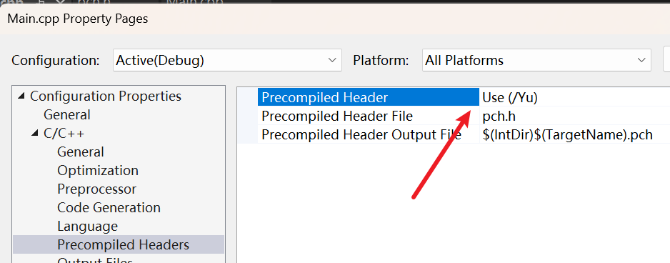  

使用了预编译头文件  

### 现在RebuildSolution  

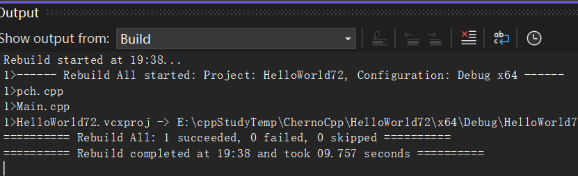  

查看生成的文件  

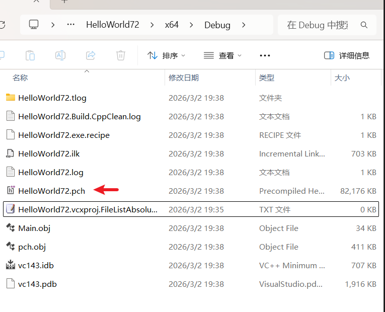  

# 对比是否使用预编译头文件

## visual studio中

开启编译计时  

Tools-Options  

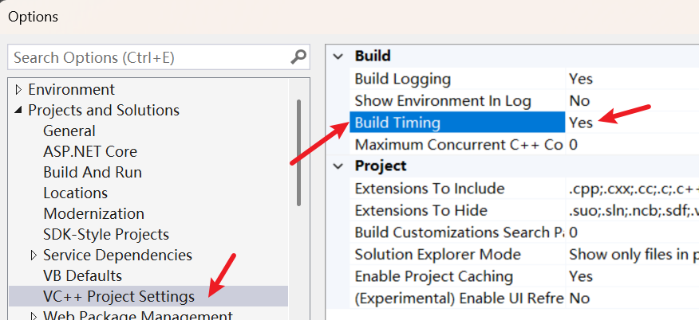  

先清理项目，然后进行构建

### 不使用预编译头文件  

项目属性--不使用预编译头文件  

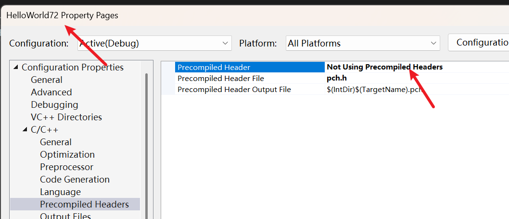  

#### 清理项目  

`10:40:53:219	========== Clean completed at 10:40 and took 02.234 seconds ==========`

#### 编译项目  

`10:37:16:501	========== Build completed at 10:37 and took 28.160 seconds ==========` 花了28秒  

#### 修改后编译项目  

修改Main.cpp并添加两行std::cout输出后再次构建`========== Build completed at 10:39 and took 12.515 seconds ==========`  花了12秒  

### 使用预编译头文件  
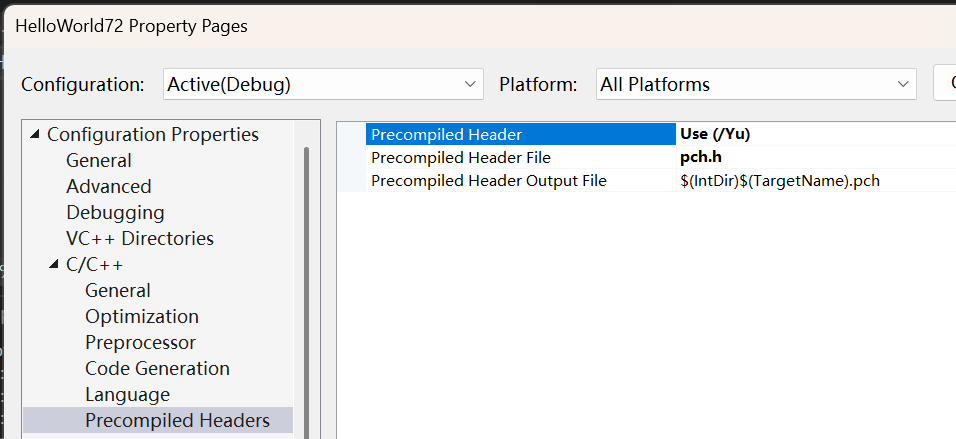  

#### 清理项目

`========== Clean completed at 10:43 and took 01.506 seconds ==========`
#### 编译项目

`========== Build completed at 10:43 and took 14.012 seconds ==========`

#### 修改后编译项目

`10:44:04:656	========== Build completed at 10:44 and took 04.586 seconds ==========`

## g++中

### 不使用预编译头文件

```cpp
/e/cppStudyTemp/ChernoCpp/HelloWorld72/HelloWorld72/src (main)
λ time g++ -std=c++11 Main.cpp

real    0m6.691s
user    0m0.047s
sys     0m0.141s
```

### 使用预编译头文件

先编译pch.h  

```cpp
/e/cppStudyTemp/ChernoCpp/HelloWorld72/HelloWorld72/src (main)
λ g++ -std=c++11 pch.h
//文件夹里会出现一个 pch.h.gch。这个 .gch 就是 g++ 版的 .pch 缓存。
```

会在文件夹生成一个pch.h.gch的文件    

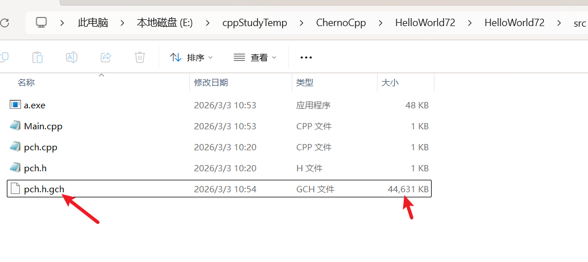  

修改Main.cpp后重新编译  

```cpp
 /e/cppStudyTemp/ChernoCpp/HelloWorld72/HelloWorld72/src (main)
λ time g++ -std=c++11 Main.cpp
//g++ 在编译 Main.cpp 时，看到 #include "pch.h"，会自动在同目录下搜索是否存在 pch.h.gch。如果找到了，它就会像 VS 一样直接加载二进制快照。

real    0m1.996s
user    0m0.031s
sys     0m0.140s
```

## 两者差异

在使用 g++（或 Clang）的手动命令行模式下，确实不需要额外创建 pch.cpp 文件。

这是因为 Visual Studio (MSVC) 和 g++ 对待预编译头的逻辑有着本质的区别。

为什么 g++ 不需要 pch.cpp？
- g++ 的逻辑（直接编译头文件）：
	g++ 允许你直接把 .h 文件当作编译目标。当你运行 g++ pch.h 时，它会直接生成一个名为 pch.h.gch 的二进制文件。
- MSVC 的逻辑（必须通过源文件触发）：
	MSVC 规定所有编译动作必须由 .cpp 文件触发。它不具备直接“编译”一个 .h 文件的功能，所以必须借用一个只有一行代码的 pch.cpp 来告诉编译器：“以此为契机，把包含的头文件打包”。

*虽然 g++ 看起来更简单，但有一个致命细节：*  

- 编译 pch.h 时的参数，必须与编译 Main.cpp 时完全一致。
- 如果你编译 pch.h 时用了 -std=c++11，但编译 Main.cpp 时没加这个参数，g++ 会==因为“环境不匹配”而默默无视掉你的预编译头，重新去读文本==。你会发现编译速度一点没变，且没有任何报错提醒。

 