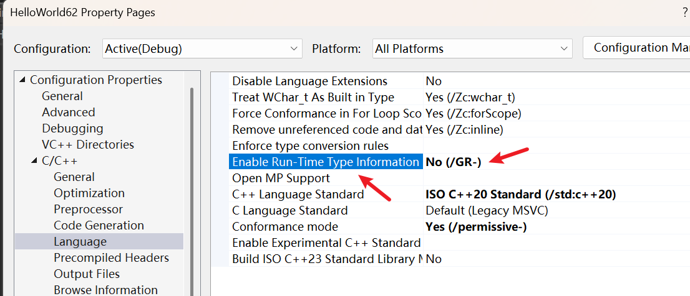
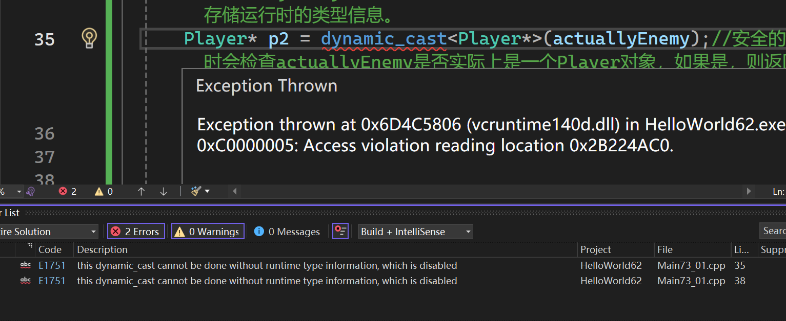

# 引入：什么是 Casting？

-   背景：在 C++ 中，我们经常需要在父类和子类指针之间转换。
-   痛点：传统的 C 风格转换 `(Player*)entity` 或 `static_cast` 是“强行”转换。编译器完全信任你，即使你把一个“敌人”对象强行转成“玩家”对象，它也不会报错，但这会导致程序在运行时崩溃。

# Dynamic Cast 的特殊性

-   一针见血的定义：`dynamic_cast` 是专门用于==继承体系==中的==安全转换==。
-   运行时检查 (RTTI ~~运行时类型信息~~ )：它不像其他转换在编译时完成，而是在==程序运行时==去检查这个对象“到底是不是”你要转的那个类型。
-   返回值逻辑    
    -   如果转换成功：返回有效的指针。
    -   如果转换失败（类型不匹配）：返回 `NULL` (或 `nullptr`)。

# 核心前置条件：虚函数表

-   关键约束：要使用 `dynamic_cast`，你的类必须是多态的 (Polymorphic)。
-   原理：这意味着基类必须至少有一个 虚函数 (Virtual Function)。
-   底层逻辑：`dynamic_cast` 依赖于 RTTI (Run-Time Type Information)，而 RTTI 信息存储在虚函数表 (vtable) 中。如果类没有虚函数，就没有 RTTI，编译器会直接报错。

# 代码实战演练

Cherno 演示了一个经典的场景：

-   基类：`Entity`
-   子类：`Player` 和 `Enemy`
-   场景：你有一个 `Entity*` 指针，你想知道它指向的到底是`Player` 还是 `Enemy`。
-   写法：
  
``` cpp
#ifdef LY_EP73

#include <iostream> 

class Entity
{
public:
	virtual void PrintName() {}
};

class Player : public Entity
{
};

class Enemy : public Entity
{
};


int main()
{ 
	Player* player = new Player();
	Entity* e = player;//隐式转换，Player* 转换为 Entity*

	Entity* actuallyEnemy = new Enemy();
	Entity* actuallyPlayer = new Player();

	//Player* p = e;//错误，Entity* 转换为 Player*，需要显示转换

	Player* p = (Player*)actuallyEnemy;//不安全的转换，Enemy* 转换为 Player*，编译器允许，但运行时会出问题；如果访问Player和Entity共有的成员，可能不会出问题，但如果访问Player特有的成员，就会出问题，因为actuallyEnemy实际上是一个Enemy对象，而不是Player对象。

	Player* p1 = static_cast<Player*>(actuallyEnemy);//和上面的显示转换一样，属于不安全的转换 

	//actuallyEnemy指向的类必须是多态的，在 C++ 的设计哲学里，非多态类确实没有存储运行时的类型信息。
	Player* p2 = dynamic_cast<Player*>(actuallyEnemy);//安全的转换，运行时会检查actuallyEnemy是否实际上是一个Player对象，如果是，则返回指向Player对象的指针；如果不是，则返回nullptr。由于actuallyEnemy实际上是一个Enemy对象，所以p2将被赋值为nullptr。


	Player* p3 = dynamic_cast<Player*>(actuallyPlayer);

	if (p2)
	{
		std::cout << "actuallyEnemy is a Player." << std::endl;
	}
	else
	{
		std::cout << "actuallyEnemy is NOT a Player." << std::endl;
	}

	if(p3)
	{
		std::cout << "actuallyPlayer is a Player." << std::endl;
	}
	else
	{
		std::cout << "actuallyPlayer is NOT a Player." << std::endl;
	}

	std::cin.get();
}

/*
actuallyEnemy is NOT a Player.
actuallyPlayer is a Player.
*/
#endif
```

# 性能代价 (The Cost)

Cherno 给出了一针见血的职业警告：

-   慢：`dynamic_cast` 比 `static_cast` 慢得多。因为它需要查询 RTTI 并在运行时进行类型比对。
-   建议：在性能敏感的游戏循环（如每秒 60 帧的更新函数）中，尽量避免使用它。可以通过枚举类型或优化设计来替代。
# 关于运行时类型信息

是可以关闭的，当然，关闭后程序运行就报错了  

  

  


# 总结

-   用途：当你拿到一个基类指针，但不确定它具体是哪个子类时，用它来保证安全。
-   精髓：它是 C++ 提供的一种“安全网”，用性能换取稳定性。


