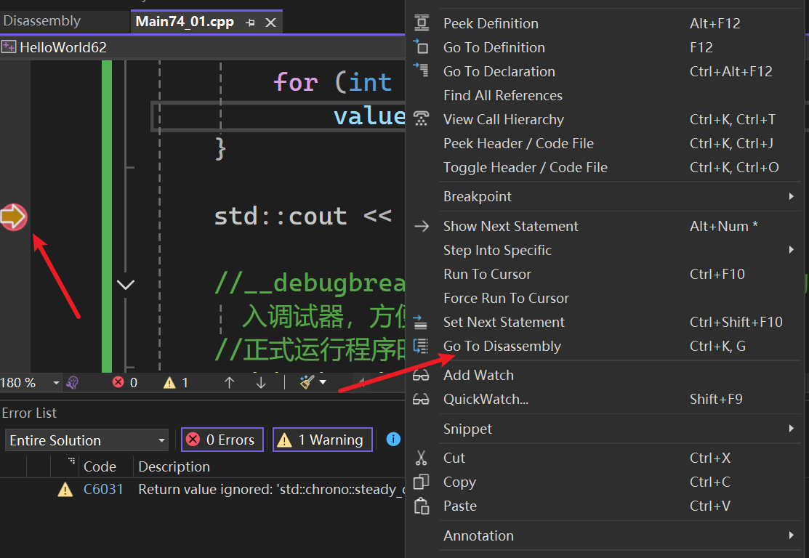
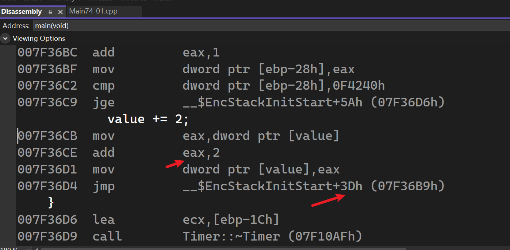
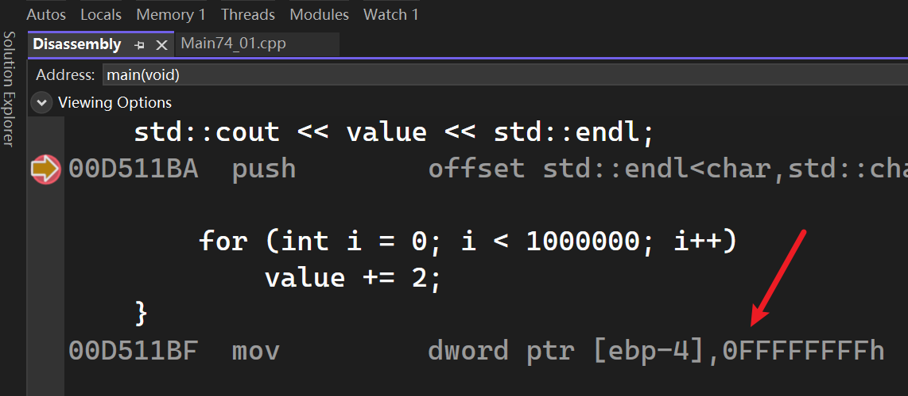

- 利用 C++ 对象的生命周期（析构函数）来自动化测量任务。
- 处理一个对性能要求很高的部分时，或者测试刚学到的新技术，此时想比较性能
- 本章节讲解如何实际测量C++代码的性能

# 测试循环所需时间

```cpp
#ifdef LY_EP74

#include <iostream>   
#include <chrono>

class Timer
{
public:
	Timer()
	{
		std::chrono::high_resolution_clock::now();
	}

	~Timer()
	{
		auto endTimepoint = std::chrono::high_resolution_clock::now();
		//算出起始时间的微秒数 
		auto start = std::chrono::time_point_cast<std::chrono::microseconds>(m_StartTimepoint).time_since_epoch().count();
		//算出结束时间的微秒数
		auto end = std::chrono::time_point_cast<std::chrono::microseconds>(endTimepoint).time_since_epoch().count();
		//算出持续时间
		auto duration = end - start;
		//将持续时间转换为毫秒并输出
		double ms = duration * 0.001;
		std::cout << duration << "us (" << ms << "ms)" << std::endl;
	}

private:
	std::chrono::time_point<std::chrono::high_resolution_clock> m_StartTimepoint;
};

int main()
{
	int value = 0;
	{
		Timer timer; // 创建一个 Timer 对象，开始计时

		for (int i = 0; i < 1000000; i++)
			value += 2;
	}

	std::cout << value << std::endl;

	//__debugbreak() 是 MSVC (Windows) 特有的编译器内置函数，会在这里中断程序，进入调试器，方便我们查看变量的值
	//正式运行程序时也会中断甚至发生异常
	__debugbreak();

}
#endif
```

先设置断点，然后进入反汇编查看  

  


当前是Debug模式  

  


Release模式下 ~~是直接在编译时就算出值而不是运行时~~   



所以说Release模式进行了优化，这里压根就没有测量所谓的加1000000次所需的时间 ~~被优化了~~ 

# 测试智能指针开销

