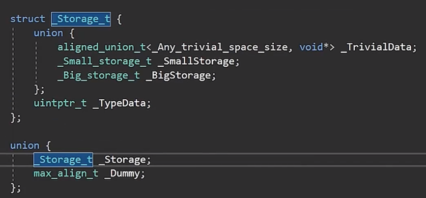
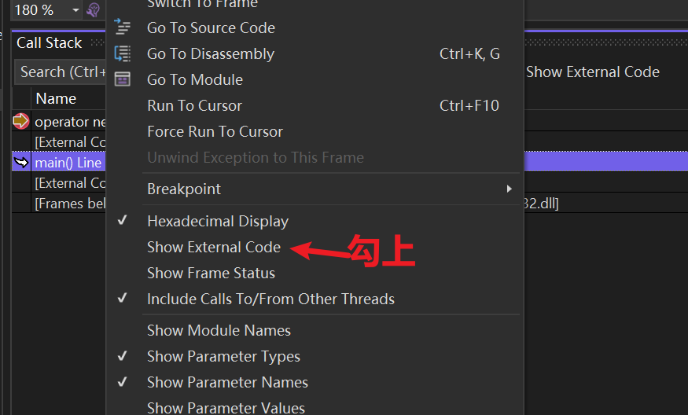
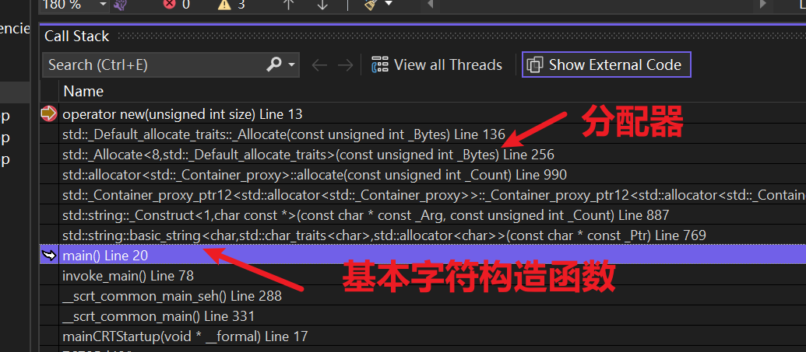
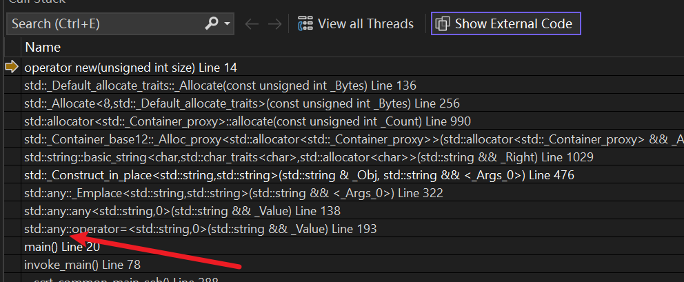
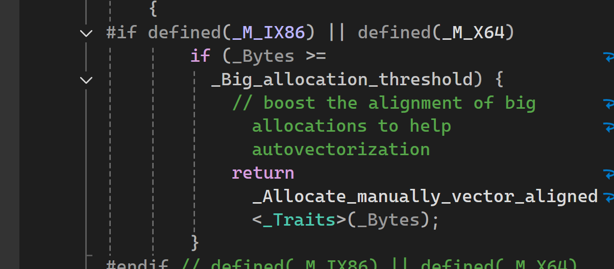

介绍了 ==C++17== 引入的 `std::any`。它是一个可以存储==绝对任何类型==变量的容器（本质上是一个==类型安全的 `void*`==），但与 `void*` 不同的是，它会处理对象的构造和析构。 
# 1\. 基本用法 

- ==包含头文件==：`#include <any>`
- ==赋值==：你可以随意给它赋值，不需要预先定义类型。

# 2\. 如何提取数据：std::any\_cast 

由于 `any` 可以是任何东西，你必须使用 `std::any_cast` 并指定类型来取回数据：

- ==按值取回==：`std::any_cast<int>(data)`。如果类型不匹配，会抛出 `std::bad_any_cast` 异常。 
- ==按引用取回==：为了性能，通常建议取引用或指针，避免拷贝。 

## 例子

```cpp
#ifdef LY_EP78

#include <iostream> 
#include <any>
#include <string>
#include <variant>

int main()
{
	std::any data;
	{
		char name[] = "Cherno";
		data = (const char*)name;// 将 name 数组的地址存储在 data 中

	} // name 数组在这里被销毁了

	// 此时 data 内部存储的指针指向了一个已经失效的内存地址（野指针）

	data = 3.45;

	//1. 构造临时对象：std::string 首先根据 "Cherno" 构造自己（这次会有一次内存分配和拷贝）。
	//2. 调用 operator=：这个临时对象被传给 std::any::operator=。
	//3. 内部转换：std::any 内部会检测到这是一个右值（临时对象），它会调用 std::string 的移动构造函数，在自己的内部空间（或它在堆上新开辟的空间）重建这个 string。
	//4. 释放临时对象：原本的临时对象变成“空壳”，随后被销毁。
	data = std::string("Cherno");// 现在 data 内部存储的是一个 std::string 对象，之前的指针已经被覆盖了

	// 这种方式直接在 data 的内部空间构造 string，效率最高
	data = std::make_any<std::string>("Cherno");

	//获取值
	std::string string = std::any_cast<std::string>(data);
	std::cout << string << std::endl;

	data = "haha";

	//运行时报错,data此时是一个const char*，不是std::string
	//std::string string2 = std::any_cast<std::string>(data);
	//std::cout << string2 << std::endl;

	std::variant<int, std::string> var;
	var = 3;
	var = "Hello";

	std::string string3 = std::get<std::string>(var);
	std::cout << string3 << std::endl;//运行正常，输出"Hello"

	std::cin.get();
	return 0;
}
#endif
```

# 3\. 工作原理与性能开销 

这是本集的重点，Cherno 解释了为什么不能滥用 `std::any`：

- ==动态内存分配（Heap Allocation）==：对于==较大==的类型，`std::any` 会在堆上分配内存。这意味着它比直接使用类型或 `std::variant` 要慢得多。 ~~动态分配内存~~  
- ==SBO（小对象优化）==：对于像 `int` 这样的==小类型== ~~大概32字节~~ ，`any` 通常会直接存在变量内部（栈上 ~~作为联合体存储~~ ），不触发堆分配，但这取决于编译器实现。  ~~所以小类型工作方式与variant完全相同~~ 
- ==类型安全==：它==内部存储了类型信息==，所以它知道你存的是什么，并能在运行时进行类型检查。 

  

如上，`_Storage_t` 是一个结构体，结构体又由一个联合体union和一个`_TypeData`组成，union有 对齐联合体，小的存储（对齐联合体），以及大的存储（被一堆填充位包围的空指针）。

## 例子1

```cpp
#ifdef LY_EP78

#include <iostream> 
#include <any>
#include <string> 

void* operator new(size_t size)
{
	//std::string("Che");中Che只有4个字符，所以不会在堆上分配；
	// std::any 在堆上分配了一个用于存储管理逻辑的小型辅助结构。（
	//而且分配了三次）
	std::cout << "Allocating " << size << " bytes" << std::endl;
	return malloc(size);
}

int main()
{
	std::any data; 
	//data = 2;
	data = std::string("Che");
	//请给我 data 内部存储的那个字符串的原件地址
	//std::string& string = std::any_cast<std::string&>(data);
	//std::cout << string << std::endl;
	////请根据 data 内部存储的内容，复印一份新的给我
	//std::string string1 = std::any_cast<std::string>(data);
	//std::cout << string1 << std::endl;

	std::cin.get();
	return 0;
}
#endif
```

在`	return malloc(size);`加断点，进入调试  

  

  

双击`operator new(unsigned int size) Line 13`，然后继续调试（F10)  

  

这里发现，any在分配  

## 例子2

```cpp
#ifdef LY_EP78

#include <iostream> 
#include <any>
#include <string> 

void* operator new(size_t size)
{
	//std::string("Che");中Che只有4个字符，所以不会在堆上分配；
	// std::any 在堆上分配了一个用于存储管理逻辑的小型辅助结构。（
	//而且分配了三次）
	std::cout << "Allocating " << size << " bytes" << std::endl;
	return malloc(size);
}

struct CustomClass
{
	std::string s0,s1;
};
int main()
{
	std::any data; 
	data = CustomClass(); 

	std::cin.get();
	return 0;
}
/*
Allocating 8 bytes
Allocating 8 bytes
Allocating 56 bytes
Allocating 8 bytes
Allocating 8 bytes
*/
#endif
```

调试时，发现进了这个代码块，即大型存储操作    



# 4\. std::any vs std::variant 

Cherno 强调了两者最本质的区别：

- ==`std::variant`==：==类型安全且高效==。你必须列出所有类型，它在编译时就确定了空间，==通常在栈上，性能接近原生类型==。 
- ==`std::any`==：==更灵活但更慢==。它不要求你列出类型，但在提取数据时有运行时开销（类型检查和潜在的堆内存解引用）。 

# 5\. 什么时候该用它？ 

- 当你真的完全不知道会接收到什么类型的数据时（例如编写极其通用的插件系统或反射系统）。
- 如果你知道可能的几种类型，==永远优先使用 `std::variant`==。 

==总结提示：== `std::any` 就像是一个“终极容器”，它虽然强大，但由于性能损耗（堆分配和运行时转换），在高性能 C++ 开发中应谨慎使用。


