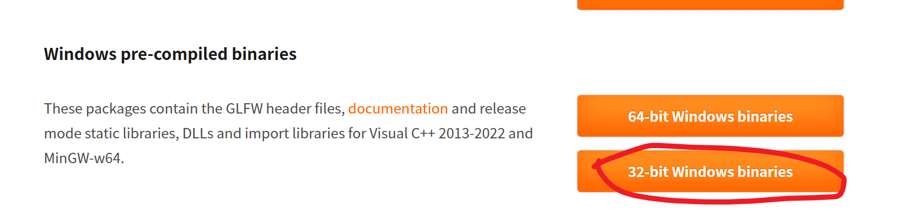
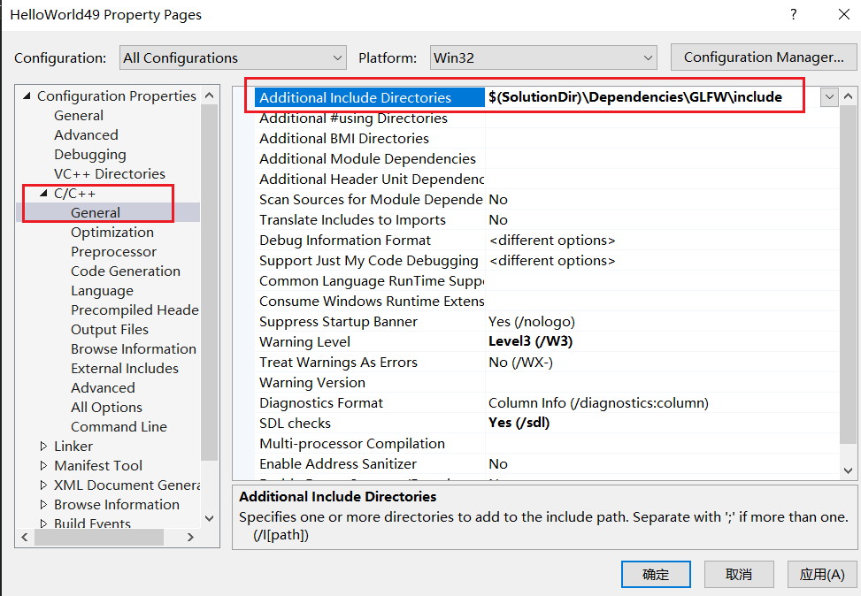
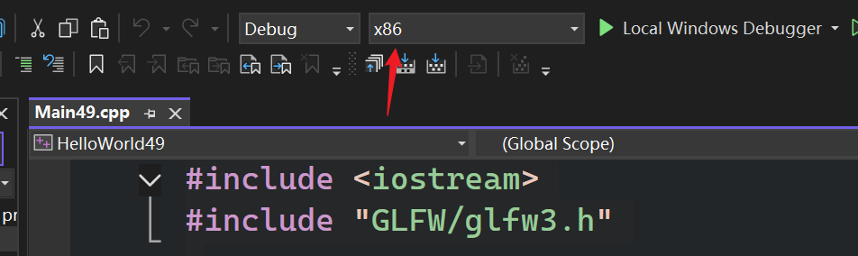
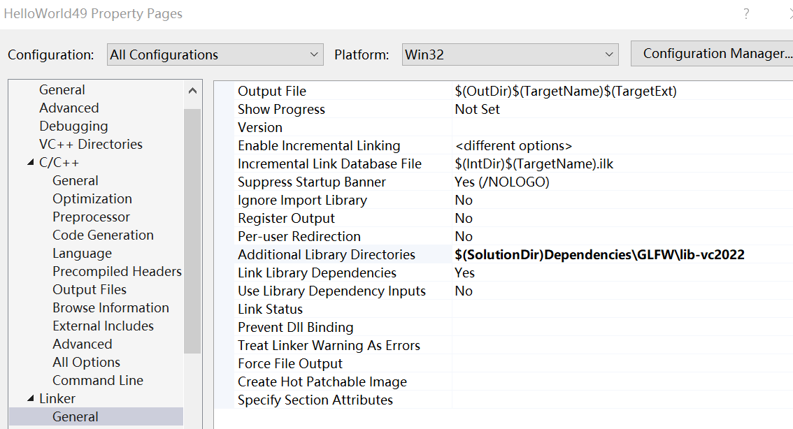
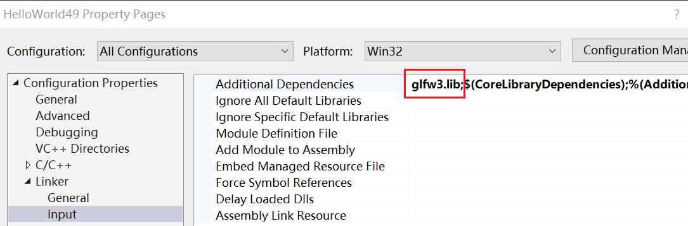
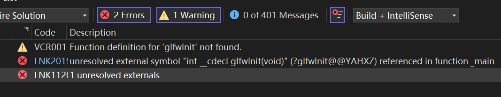

# 49使用静态库

- 从github库或其他敌法check out代码块，在那个代码库里能直接得到编译所需的一切，并运行应用程序或项目等，无需使用包管理器
- 倾向于实际保留依赖项的版本，实际解决方案中二进制的版本。实际项目文件夹中有物理二进制文件的副本，或者是源码

要==自己编译==？或者直接链接预构建的二进制文件  

- 建议直接添加另一个项目（依赖项的源代码），然后编译成静态库或动态库
- 非大型项目，可以直接链接二进制文件（无需源代码）

本篇要处理的是GLFW的库  

选择二进制版本 (32位 vs 64位)，这取决于你的==目标应用程序架构==，而不是你的操作系统。  

比如现在我要制作一个32位应用程序  
  

```cpp
//结构

//里面通常是 HTML 格式的 API 手册。
├─docs
│  └─html
│      └─search
├─include
│  └─GLFW

//含义： 针对 MinGW 编译器的版本（通常配合 GCC 使用）。
//用途： 如果你不在 Windows 上用 Visual Studio，而是用 CLion、Code::Blocks 或者直接在命令行用 g++ 编译，你需要链接这个文件夹里的库（通常是 .a 文件而非 .lib）。
├─lib-mingw-w64 
│  └─libglfw3.a //(静态库)： 如果你用 MinGW 编译器并想进行静态链接
│  └─glfw3.dll //(动态链接库)： 这是库的实体。 如果你选择动态链接，这个文件必须在运行时放在你的 .exe 旁边
│  └─libglfw3dll.a //给编译器看的“目录”。 当你选择动态链接时，你不是直接链接 .dll，而是链接这个 .a 文件。 它告诉编译器：“真正的代码在 glfw3.dll 里，你先编译通过，运行时再去调它。”

//如果你的项目配置为使用通用的 Windows 10/11 SDK 运行时，有时需要专门链接这个版本的库。
├─lib-static-ucrt

//以下是库文件 (.lib)，是给 链接器 用的。之所以有这么多，是因为 C++ 的二进制兼容性比较复杂，库的版本必须尽量与你使用的 Visual Studio 版本匹配
├─lib-vc2013
├─lib-vc2015
├─lib-vc2017
├─lib-vc2019
└─lib-vc2022
```

库由*包含目录includes*和*库目录libraries*组成  

- includes：一堆头文件，以便用上预构建二进制里面的函数
- lib目录：预构建的二进制文件（通常有动态库和静态库）
	

# 动静态区别

- 静态链接意味着==库被直接放入可执行文件==(.exe)
	- 在技术上更快，==编译器或链接器可进行优化==
- 动态库，在运行时才进行链接。1. 可以选择即时加载动态库，有个名为加载库的函数。可以提取函数指针，并调用函数2. 也可以在应用启动时加载动态链接库文件
	- 运行时，库有一个单独的文件==（动态连接库文件）==，需将其与==可执行文件==一同放置，或置于某处使可执行文件能加载那些不同内容
	- 由于（编译器、链接器）无法预知会发生什么，所以无法提前优化

# 关于编译和链接的知识补充

==没错，链接器（Linker）完全不关心头文件。==

为了理解这句话，我们需要拆解 C++ 从代码到程序的两个关键阶段：==编译阶段==和==链接阶段==。

### 1. 编译阶段（Compiler）：“指向头文件”

当你写下 `#include <GLFW/glfw3.h>` 时，你实际上是在告诉==编译器==：“这里有一个函数叫 `glfwInit()`，我待会要用，你先别报错。”

* ==编译器的任务：== 将你的每个 `.cpp` 文件单独转换成机器码（`.obj` 文件）。
* ==为什么需要头文件：== 编译器在处理 `main.cpp` 时，如果不看头文件，它就不认识 `glfwInit`。它需要头文件来确认：这个函数的参数对不对？返回值是什么？
* ==“指向”的意思：== 编译器并不会自动搜索你电脑上所有的文件夹。你必须在 Visual Studio 的 ==“附加包含目录”（Additional Include Directories）== 中告诉它：==“嘿，如果我在代码里 include 了东西，去这个文件夹里找！”==

### 2. 链接阶段（Linker）：头文件功成身退

一旦 `.cpp` 变成了 `.obj`（目标文件），编译器的工作就结束了。此时的 `.obj` 文件里只是一堆“坑”，比如它知道这里要调用 `glfwInit`，但它不知道这个函数的具体代码在哪。

* ==链接器的任务：== 把所有的 `.obj` 文件和 ==库文件（.lib）== 缝合在一起，填满那些“坑”。
* ==为什么不需要头文件：== 链接器处理的是二进制数据。它寻找的是具体的==符号（Symbols）==。它会去 `.lib` 文件里翻找，看看谁实现了 `glfwInit`。
* ==如果报错：== 如果你没“指向”好头文件，报错是 ==编译错误==（如：`identifier not found`）。
* 如果你没“指向”好库文件（.lib），报错是 ==链接错误==（如：`LNK2019: unresolved external symbol`）。
### 3. 总结它们的职责

| 阶段               | 参与者 | 需要什么？          | 目的                         |
| ---------------- | --- | -------------- | -------------------------- |
| ==编译 (Compile)== | 编译器 | ==头文件 (.h)==   | 验证语法、函数声明，生成中间代码。          |
| ==链接 (Link)==    | 链接器 | ==库文件 (.lib)== | 把声明和实际的功能实现关联起来，生成 `.exe`。 |

---

### 形象的比喻

想象你在组装家具：

* ==头文件（编译器用）：== 就像是 ==说明书==。它告诉你“这里需要一颗 M8 螺丝”。编译器看到说明书，觉得逻辑通顺，通过！
* ==库文件（链接器用）：== 就像是 ==零件盒==。里面真的躺着那颗“M8 螺丝”。链接器负责把零件盒里的螺丝拧进家具里。

如果你只有说明书（头文件）却没有零件盒（库文件），家具（程序）是组装不起来的。

---

本篇集中，Cherno 强调了两个步骤：一是在 C/C++ 选项里配置包含目录（为了编译），二是在 Linker 选项里配置库目录和依赖项（为了链接）。

# 对头文件、库文件设置

## 下载

在visual studio中，对于编译器而言，我们需要将它指向头文件，这样就知道自己==能用==哪些函数，从而拥有==函数声明、变量声明== ~~符号声明~~ 。之后还要让链接器找到库 ~~静态库或动态库~~ 文件，这样才能真正链接函数定义  

再次查看前面在 https://www.glfw.org/ 下载的文件夹  
```cpp
├─docs
│  └─html
│      └─search
├─include   //---复制这个头文件
│  └─GLFW
├─lib-mingw-w64
├─lib-static-ucrt
├─lib-vc2013
├─lib-vc2015
├─lib-vc2017
├─lib-vc2019
└─lib-vc2022  //---复制这个库二进制文件
```

项目的根目录（文件夹）结构如下  

```cpp
├─HelloWorld49
│  ├─Dependencies
│  │  └─GLFW
│  │      ├─include //刚才复制的
│  │      │  └─GLFW
│  │      └─lib-vc2022 //刚才复制的
│  └─HelloWorld49
```

具体查看一下  

```cpp
─GLFW
    ├─include
    │  └─GLFW  //一堆头文件
    │          glfw3.h
    │          glfw3native.h
    │
    └─lib-vc2022
            //==================================================
            glfw3.dll //用于运行时动态链接，不是给编译器看的，是给 Windows 系统看的。
//运行： 你必须手动把这个文件拷贝到你生成的 .exe 所在的文件夹里，否则程序启动会报错。

            glfw3dll.lib //导入库（Import Library）。它里面没有真正的功能代码，只有一张“地图”，告诉你的 .exe 去哪里找 glfw3.dll。编译阶段，你依然要在 VS 里链接这个 .lib。
            
            //==================================================
            //静态库，如果不需要 “仅编译时/动态链接” 链接就使用这两个
            //1. 标准静态库
            glfw3.lib 
            //2. 多线程的
            //它是专门为你将 Visual Studio 的“运行库”设置为 多线程 (/MT) 时准备的版本。
            //注意： 如果你在项目设置里用了 /MT，就链接这个；如果你用的是默认的 /MD，就链接上面那个 glfw3.lib。
            glfw3_mt.lib
```

### 分析一下动态连接器的两个文件

链接阶段不需要 .dll 
在 Windows 的动态链接机制中，角色分工非常明确：

- .lib (导入库/Import Library)： 它是给 Visual Studio（链接器） 用的。它就像是一份“合同”或者“承诺书”。它告诉链接器：“glfwInit 这个函数在运行时会从一个叫 glfw3.dll 的文件里跳出来，你现在先给 .exe 预留一个位置，标记好去哪里找它就行了。”
- .dll (动态库)： 它是给 Windows 操作系统 用的。只有当你双击 .exe 运行的那一刻，系统才会去硬盘上找这个 .dll 并把它加载到内存里。

| 特性     | 真正的静态库 (`glfw3.lib`) | 导入库 (`glfw3dll.lib`)       |
| :----- | :------------------- | :------------------------- |
| **内容** | 包含函数的所有实际代码（机器码）。    | 只有函数名单和 DLL 的跳转地址。         |
| **体积** | 通常较大（几百 KB 到几 MB）。   | 非常小（通常只有几 KB）。             |
| **后果** | 代码直接塞进 `.exe`，不需要外挂。 | `.exe` 里只有“去某某 DLL 找我”的标记。 |

## 设置头文件
右键项目--属性--ConfigurationProperties/C_C++/General/AdditionalIncludeDirectories，填入 `$(SolutionDir)\Dependencies\GLFW\include`  

  


之后测试一下:  
~~注意，解决方案平台要选x86~~    


```cpp
#include <iostream>
#include "GLFW/glfw3.h"
//#include <GLFW/glfw3.h>

int main()
{
	int a=glfwInit();
	std::cout << a << std::endl;
	std::cin.get();
}


//Ctrl+F7 编译通过，如果F5则运行失败（还没添加链接库）
/*
Build started at 15:28...
1>------ Build started: Project: HelloWorld49, Configuration: Debug Win32 ------
1>Main49.cpp
========== Build: 1 succeeded, 0 failed, 0 up-to-date, 0 skipped ==========
========== Build completed at 15:28 and took 06.229 seconds ==========
*/
```

### include 尖括号和引号的区别  

实际上，双引号是尖括号的“超集”。如果编译器在当前目录找不到引号里的文件，它会自动去系统路径找。  

| 方式                         | 搜索顺序                                                             | 适用场景                        |
| :------------------------- | :--------------------------------------------------------------- | :-------------------------- |
| **`#include "..."`** (双引号) | 1. **当前源文件所在的目录**。2. 项目设置中的“附加包含目录”。3. 系统标准库目录。                  | 程序员自己写的头文件，或者放在项目文件夹内的第三方库。 |
| `#include <...>` (尖括号)     | 1. 项目设置中的“附加包含目录”。2. **系统标准库目录**（如 `iostream`）。3. 编译器通常跳过当前目录搜索。 | 标准库（STL）或已经安装到系统路径下的第三方库。   |

## 设置链接库  

### 指定库目录
右键项目--属性--ConfigurationProperties/Linker/General/AdditionalLibraryDirectories，填入 `$(SolutionDir)\Dependencies\GLFW\lib-vc2022`    

  

### 指定与该库目录相关的库文件名

在 ConfigurationProperties - Linker - Input - Additional Dependencies中，填入 glfw3.lib;  

    
此时F5运行正常  


# 有个问题  

```cpp
#include <iostream>
int glfwInit();

int main()
{
	int a = glfwInit();
	std::cout << a << std::endl;
	std::cin.get();
}

```

上述代码编译通过 但运行报错(链接失败)  

  

因为 glfw 实际上是一个C库  

使用extern "C" 解决问题  

```cpp
#include <iostream>
extern "C" int glfwInit();

int main()
{
	int a = glfwInit();
	std::cout << a << std::endl;
	std::cin.get();
}
```

## 原因

1. 核心原因：名字修饰 (Name Mangling)
C++ 支持函数重载（即可以有多个同名但参数不同的函数）。为了区分这些函数，C++ 编译器会偷偷修改函数的名字，把参数信息编码进去。

- C 语言： 非常简单。函数 glfwInit 在编译后，二进制文件里的名字依然是 glfwInit。
- C++ 语言： 编译器会对其进行“修饰”。它可能会把 glfwInit() 变成类似 ?glfwInit@@YAHXZ 这样奇怪的名字。

2. 链接时的“对接”失败
当你链接像 GLFW 这种用 C 语言 编写的库时：

- 库文件 (.lib) 里存的名字是：glfwInit。
- 你的 C++ 代码（如果不加 extern "C"）在找的名字是：?glfwInit@@YAHXZ。

链接器（Linker）在 .lib 文件里翻遍了也找不到这个“外星语”一样的名字，于是就会抛出著名的 LNK2019: 无法解析的外部符号 错误。

3. extern "C" 的作用
当你写下 extern "C" 时，你是在告诉 C++ 编译器：

“嘿，别给这个函数搞你的那一套名字修饰！请按照 C 语言的标准，老老实实地保留它的原名。”

这样，你的代码生成的调用请求就是 glfwInit，正好能和库文件里的名字对上。