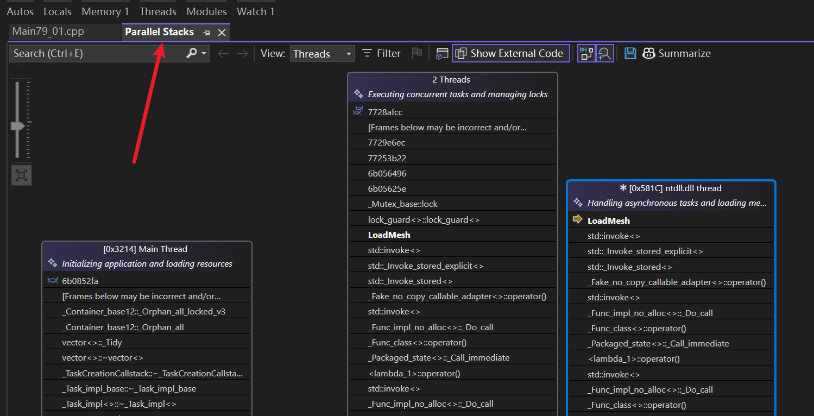

*如何利用 `std::async` 让 C++ 运行更快*  

这一集的核心在于展示如何通过==多线程异步==处理来==优化原本串行执行的耗时==操作，主要讲解了 `std::async` 的用法及其与 `std::future` 的配合。


# 1\. 问题背景与性能现状 

- ==串行执行的局限性==：Cherno 首先展示了一个简单的示例程序（通常是加载资源或执行大量计算）。在单线程环境下，这些任务必须一个接一个地完成，导致总耗时是所有任务时间的总和。
- ==性能瓶颈==：如果其中一个任务（如 `LoadFunction`）非常耗时，整个程序就会被阻塞，无法利用现代 CPU 的多核优势。

> 如今的游戏加载非常长，原因是需要加载的资源太多，加载过程不仅仅是从磁盘读取文件，涉及解压文件、将其发送到图形处理器、根据特定情况特定转换，但每一项资源、纹理、模型通常相互独立，即它们是多线程的理想选择


# 2\. 引入 `std::async` 

- ==什么是 `std::async`==：它是 C++11 引入的一个高级 API，用于启动异步任务。它比手动创建 `std::thread` 更简单，因为它能自动处理线程的创建和管理。
- ==`std::launch` 策略==：
    
    - `std::launch::async`：强制在不同线程中异步运行。
    - `std::launch::deferred`：延迟执行，直到调用 `get()` 或 `wait()` 时才在当前线程运行。
- ==基本语法==：展示如何将普通函数调用包装进 `std::async` 中。

```cpp
#ifdef LY_EP79

#include <iostream> 
#include <thread>
#include <chrono>
#include <future> 

static std::mutex mtx;
static std::vector<int> meshes;

static void LoadMesh(int i)
{
	std::cout << "Loading mesh...[" << i << "]\n";

	//加锁->互斥锁
	//该锁在当前作用域结束时自动释放 
	std::lock_guard<std::mutex> lock(mtx);

	//模拟：将加载的网格ID添加到共享资源中
	meshes.push_back(i);
	std::cout << "Mesh Added: " << i << "\n";


}

void LoadMeshes()
{
	//因为这里的异步任务，即LoadMesh函数返回void，所以我们使用std::future<void>来存储这些异步任务的结果。
	std::vector<std::future<void>> futures;

	for (int i = 10; i < 15; i++)
	{
		// std::async ：立即在后台开启一个新的线程，去执行 LoadMesh(i) 这个函数，不要阻塞我当前的进度。
		
		//1. 但是，因为它返回的 std::future 没有赋值给任何变量，它会在这一行结束时立刻析构。
		//2. std::future 的析构函数逻辑是：“等一下！任务还没跑完，我不能死，我要阻塞主线程直到子线程结束。”
		//3. 所以，最终导致主线程在每次调用 std::async 后都被阻塞，等待子线程完成，才继续下一次循环。
		//std::async(std::launch::async, LoadMesh, i);

		// 将 future 存入 vector，防止它立即析构
		//在单独线程中加载网格
		futures.push_back(std::async(std::launch::async, LoadMesh, i));
	}


}


void LoadMeshesSync()
{
	for (int i = 10; i < 15; i++)
	{
		LoadMesh(i);
	}


}

int main()
{
#define ASYNC 1
#if ASYNC 
	LoadMeshes();
#else
	LoadMeshesSync();
#endif
	std::cin.get();
	return 0;
}
/* Mesh Added:顺序是随机的，因为可能某线程执行std::lock_guard<std::mutex> lock(mtx);这行代码前，被其他线程抢先
Loading mesh...[10Loading mesh...[11]
]
Loading mesh...[12]
Loading mesh...[13]
Loading mesh...[14]
Mesh Added: 11
Mesh Added: 10
Mesh Added: 12
Mesh Added: 13
Mesh Added: 14
*/
#endif
```

通过parallel Stacks查看不同线程栈信息    


# 3\. 使用 `std::future` 获取结果 

- ==`std::future` 的作用==：`std::async` 会返回一个 `std::future` 对象。它就像是一个“凭据”，代表了一个未来才会产生的结果。
- ==`.get()` 方法==：这是阻塞操作。调用 `get()` 时，如果异步任务还没完成，当前线程会等待；如果已完成，则直接获取返回值。 ~~视频没讲到这个知识点~~ 
- ==生命周期陷阱==：Cherno 特别强调，==不要忽略 `std::async` 的返回值==。如果你不把返回的 `future` 赋值给一个变量，它的析构函数会立即阻塞当前线程直到任务完成，从而使异步失去意义，变回同步执行。

# 4\. 实战演示：并行化改造 

- ==代码重构==：将原本循环中的同步调用改为 `std::async` 调用，并将所有的 `future` 存储在一个 `std::vector` 中。
- ==对比结果==：通过计时器对比发现，原本需要数秒完成的任务，在多线程并行下，总耗时显著下降（接近于最慢的那个单体任务的时间）。

# 5\. 注意事项与总结 

- ==线程开销==：虽然 `std::async` 很快，但创建线程本身是有开销的。对于极小的任务，多线程可能反而更慢。
- ==调试建议==：异步代码的调试比单线程复杂，建议在逻辑确定后再进行并行优化。
- ==核心结论==：`std::async` 是在 C++ 中实现多线程并行、提升程序响应速度和计算效率最简单、最快捷的工具之一。


