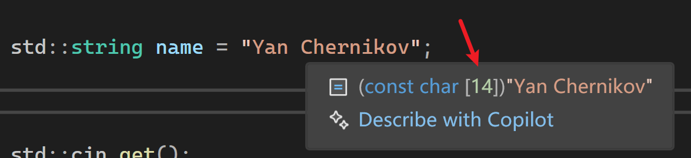

# 附：常量字符串

```cpp
	std::string name = "Yan Chernikov";
```

## 关于空字符

- 右侧的字面量 "Yan Chernikov"(13个看得见的字符) 在内存（常量区）中以 \0 结尾。
- 左侧的 std::string 对象 会在堆上申请空间，并把这 13 个字符拷贝过去。
- 关键点：std::string 内部实现总是会额外多分配一个字节来存储这个 \0。这是为了确保当你调用 name.c_str() 时，能返回一个符合 C 语言标准的、以空字符结尾的字符串。
## 关于赋值

- 字面量字符串是一个const char[N]类型的数组 
1. 数组退化 (Array-to-pointer decay)：
	字符串字面量首先从 const char[14] 退化为指向首元素的指针 const char* 。
	  
	
2. 调用构造函数(Implicit Constructor Call)：
	std::string 类有一个接收 const char* 参数的构造函数。由于该构造函数没有被标记为 explicit，编译器会自动调用它来创建一个临时的 std::string 对象。	 
3. 内存分配(The "Cost")：
	正如 Cherno 在第 80 集中强调的，这个隐式转换并不只是“换个名字”，它会在 堆（Heap）上分配内存，并将字符串内容拷贝进去。
- name.size()：返回 13（不计入 \0）。
- name\[13\]：在 C++11 及以后的标准中，访问这个位置是合法的，它会返回 \0。
# 调试注意

本篇测试均在Release模式下测试，因为Debug模式下由于调试需要会有其他的内存分配  

```cpp
#ifdef LY_EP80

#include <iostream>  
#include <string>

static uint32_t s_AllocaCount = 0;

//重载new运算符
void* operator new(std::size_t size)
{
	s_AllocaCount++;
	printf("Allocating %zu bytes of memory.\n", size);
	return malloc(size);
} 

int main()
{  
	
	//std::string 在栈上预留了 15 字节 的缓冲区，无需堆分配。
	std::string name = "Yan Chernikov";//13个字符 
	
	//Debug模式下输出Allocating 8 bytes of memory.（调试代理、迭代器调试需要的8字节）
	//Release模式下没有输出
	std::string name1 = "012345678901234567891";//21个字符 

	/*现代 CPU 处理内存时，如果地址是 16 或 32 的倍数，效率最高。以下是输出
	Allocating 32 bytes of memory.
	*/
	 
	std::cin.get();
	return 0;
} 
#endif
```
#  1\. 问题所在：不必要的内存分配 

传统的 `std::string` 在进行截取、传递或操作时，往往会触发==动态内存分配（Heap Allocation）==。

- 即使你只是想查看字符串的一部分，`std::string::substr` 也会创建一个全新的字符串副本（超过缓冲区大小才会创建）。
- ==内存分配是昂贵的操作，频繁分配会显著降低程序运行速度==。

```cpp
#ifdef LY_EP80 

#include <iostream>  
#include <string>

static uint32_t s_AllocaCount = 0;

//重载new运算符
void* operator new(std::size_t size)
{
	s_AllocaCount++;
	printf("Allocating %zu bytes of memory.\n", size);
	return malloc(size);
}

void PrintName(const std::string& name)
{
	std::cout << "Name: " << name << std::endl;
}

int main()
{
	//std::string 在栈上预留了 15 字节 的缓冲区，无需堆分配。
	//用于 SSO 的本地数组大小定义为 16 字节（包括结尾的 null 字符），因此可以存储最多 15 个字符的字符串。
	std::string name = "Yan Chernikov";//13个字符 

	std::string name1 = "012345678901234567891";//21个字符 

	//substr(起始位置，长度)
	//正好15，没有堆分配
	std::string firstName1 = name1.substr(0, 15);
	std::cout << "firstName1--length:" << firstName1.size() << std::endl; 
	//小于15，没有堆分配
	std::string lastName1 = name1.substr(10, 20);
	//没有赋值，但是产生了临时对象，进行了堆分配 
	name1.substr(0, 20);
	 

	std::cout << "=======0========" << std::endl;

	//堆分配64字节
	std::string name2 = "01234567890123456789012345678901234567890123456789";//50个字符 

	std::cout << "=======1========" << std::endl;
	//堆分配48字节（因为substr的结果加上\0是33字节）
	std::string firstName2 = name2.substr(0, 32);
	std::cout << "=======2========" << std::endl;
	//堆分配32字节
	std::string lastName2 = name2.substr(0, 31);


	//PrintName(name);

	std::cin.get();
	return 0;
}
/*
Allocating 32 bytes of memory.
firstName1--length:15
Allocating 32 bytes of memory.
=======0========
Allocating 64 bytes of memory.
=======1========
Allocating 48 bytes of memory.
=======2========
Allocating 32 bytes of memory.
*/
#endif
```

#  2\. 解决方案：`std::string_view` 

`std::string_view` 本质上是一个\*\*“观察者”\*\*，它只包含两个简单的部分：

- 一个指向现有字符串数据的==指针==。
- 字符串的==长度==。 它不会复制数据，也不会分配内存，只是“看向”已经存在的内存区域。

```cpp
#ifdef LY_EP80 

#include <iostream>  
#include <string>

static uint32_t s_AllocaCount = 0;

//重载new运算符
void* operator new(std::size_t size)
{
	s_AllocaCount++;
	printf("Allocating %zu bytes of memory.\n", size);
	return malloc(size);
}

void PrintName(const std::string& name)
{
	std::cout << "Name: " << name << std::endl;
}
void PrintName1(std::string_view name)
{
	std::cout << "Name: " << name << std::endl;
}

int main()
{ 
	//堆分配64字节
	std::string name2 = "01234567890123456789012345678901234567890123456789";//50个字符 

	std::cout << "=======1========" << std::endl;
	//堆分配48字节（因为substr的结果加上\0是33字节）
	std::string firstName2 = name2.substr(0, 32);
	std::cout << "=======2========" << std::endl;
	//堆分配32字节
	std::string lastName2 = name2.substr(0, 31); 

	std::cout << "Allocat times:" << s_AllocaCount << std::endl;//3
	
	//没有产生堆分配，string_view只是一个轻量级的视图，不会复制字符串数据
	//当你对它进行 substr 截取时，它不会修改原始内存，也不会在截取的地方放一个 \0 
	std::string_view firstName3(name2.c_str(), 32);
	//没有产生堆分配
	std::string_view lastName3(name2.c_str(), 31);

	std::cout << "Allocat times:" << s_AllocaCount << std::endl;//3

	//没有产生堆分配
	const char* myStr= "01234567890123456789012345678901234567890123456789";
	

	//没有产生堆分配
	std::string_view lastName4(myStr, 31);

	//没有堆分配
	PrintName("hello");

	//一次堆分配64字节
	PrintName("01234567890123456789012345678901234567890123456789");//40个字符

	//没有堆分配，string_view只是一个轻量级的视图，不会复制字符串数据
	PrintName1("01234567890123456789012345678901234567890123456789");//40个字符


	std::cin.get();
	return 0;
}
/*
Allocating 64 bytes of memory.
=======1========
Allocating 48 bytes of memory.
=======2========
Allocating 32 bytes of memory.
Allocat times:3
Allocat times:3
Name: hello
Allocating 64 bytes of memory.
Name: 01234567890123456789012345678901234567890123456789
Name: 01234567890123456789012345678901234567890123456789
*/
#endif
```

#  3\. 性能对比实验 

Cherno 通过编写一个自定义的内存分配器（重载 `new` 运算符）来监控分配次数：

- ==使用 `std::string`==：每次调用 `substr` 都会看到控制台打印出内存分配的记录。
- ==使用 `std::string_view`==：在处理相同的子字符串操作时，控制台显示==零次==内存分配。这在处理大型文本或高频循环时，性能提升非常巨大。

#  4\. 关键应用场景 

- ==函数参数==：建议将 `const std::string&` 替换为 `std::string_view`。这样无论传入的是字符串常量、字符数组还是 `std::string` 对象，都不会产生多余的拷贝或分配。
- ==解析大型文本==：在处理数兆字节的文件时，使用 `string_view` 进行切片解析，速度会比常规方法快得多。

#  5\. 注意事项与潜在陷阱 

- ==生命周期问题==：由于 `string_view` 只是个观察者，它不拥有内存。如果原始字符串被销毁（例如指向了一个局部变量），`string_view` 就会变成悬空指针，导致崩溃。
- ==Null 终止符==：`string_view` 不保证以 `\0` 结尾。如果你需要将其传递给传统的 C 语言 API（如 `printf` 或 `strlen`），必须非常小心。

### 结论

通过使用 `std::string_view` 代替传统的字符串拷贝，你可以避免 90% 以上不必要的堆内存分配，从而让 C++ 的字符串处理达到极致性能。


