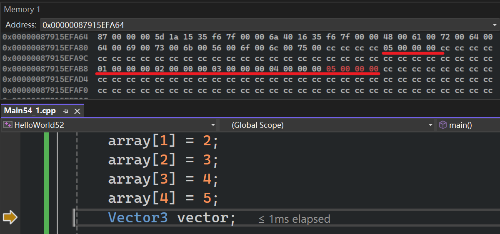
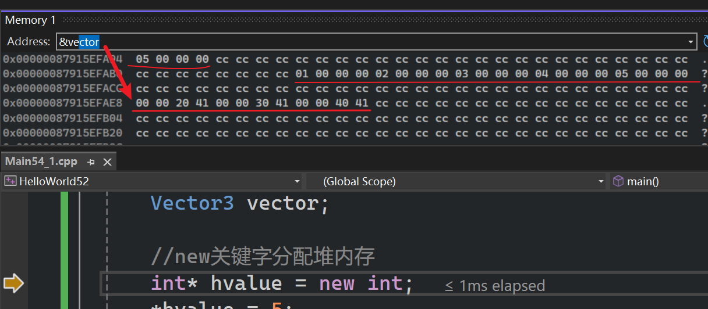

栈和堆何时被使用，为何被使用，以及如何运作  

- 程序运行时，操作系统会把整个程序加载到内存中，同时分配大量物理内存
- 栈和堆是==内存中==实际存在的两个区域
	- 栈具有预定义的大小，通常约2兆字节
	- 堆也有预定义默认值，随着应用程序运行，它会增长变化
	- 我们需要一个地方存储运行程序所需的数据，如局部变量、或者从文件读取数据
- 请求内存，也称内存分配

接下来看看在栈上分配一个整数，和在栈上分配其他数据的差异。与实际c++代码的堆相比  
# 代码

```cpp
#include <iostream>
#include <string>

struct Vector3
{
	float x, y, z;
	Vector3()
		:x(10), y(11), z(12)
	{

	}
};

int main()
{
	//在栈上分配内存
	int value = 5;
	int array[5];
	array[0] = 1;
	array[1] = 2;
	array[2] = 3;
	array[3] = 4;
	array[4] = 5; 
	Vector3 vector;

	//new关键字分配堆内存
	int* hvalue = new int;
	*hvalue = 5;
	int* harray = new int[5];
	harray[0] = 1;
	harray[1] = 2;
	harray[2] = 3;
	harray[3] = 4;
	harray[4] = 5;
	//()可以省略
	Vector3* hvector = new Vector3();

	std::cin.get();
}
```

# 栈
   
  

  

调试模式下，变量之间有一些字节，因为所有变量周围会添加安全防护，以确保不让他们溢出或在错误内存地址访问他们    

  

- 00 00 20 41 $\rightarrow$ 对应 10.0
- 00 00 30 41 $\rightarrow$ 对应 11.0
- 00 00 40 41 $\rightarrow$ 对应 12.0
以上是在x64平台调试时的地址，函数中声明的变量是先放在低地址，再放在高地址  

以下是x86平台调试时，函数中声明的变量是==先放在高地址，再放在低地址==  

  

之前在《深入理解计算机系统》一书中提到栈中先声明的变量是先放在高地址的，这里不知道为啥x86会相反，ai的回答是为了优化调整了顺序  
- x86 的逻辑是“推（Push）”：局部变量是一个个压进去的，所以声明顺序 = 压栈顺序 = 地址递减顺序。
- x64 的逻辑是“填（Fill）”：函数进来先执行 sub rsp, 0x50 挖个大坑。在这个坑里，编译器像是个装修工，它会根据内存对齐需求，从这个坑的“天花板”往“地板”填，或者反过来。
## 解释

*假设以下是先分配高地址，再分配低地址*  

当我们在栈中分配变量时，发生变化的是栈指针，栈顶指针会移动相应字节
- 如果要分配一个int，那么就会把栈顶指针移动4字节
- 如果要分配一个数组，这里是5x4=20，那么就会把栈顶指针移动20字节
- 像栈一样==依次堆叠==，大多数栈实现中栈是向后增长。所以首个值存储在更高的内存地址
- 比如我要分配一个整数，那就把栈指针向后移动4个字节（-4），然后返回该内存地址  
  

```cpp
sub rsp, 4    ; 将栈指针减去 4 (栈向低地址增长，减法代表分配)
mov [rsp], 10 ; 将数值 10 放入刚刚“圈出来”的那块地
```

# 堆

不同变量在内存中地址是无序的，没有先后，更没有相连  

  

当然，同一个数组不同元素间是有序的  

