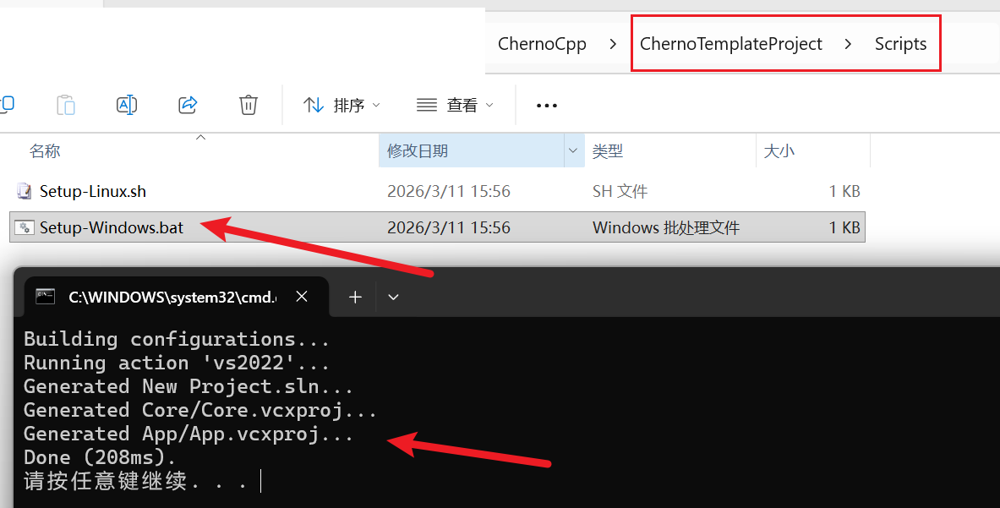
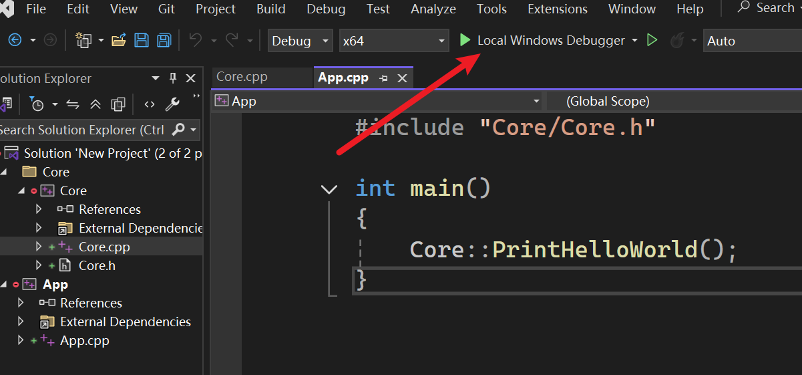

# 创建项目并克隆

`https://github.com/TheCherno/ProjectTemplate` ，到这个地址 UseThisTemplate -> CreateNewRepository  

在本地windows克隆下来  

```shell
git clone git@github.com:lwmfjc/ChernoTemplateProject.git
```

之后我把项目删掉.git文件夹后放到了另一个自己的备份gitRepository中

# 使用

双击Setup-Windows.bat 运行  

  


在visual studio中，File-Open-Solution，选择 NewProject.sln    

打开之后直接F5运行  

  

==这集先跳过，貌似有点不太常用 ~~注：看到00:07:34~~ ==

