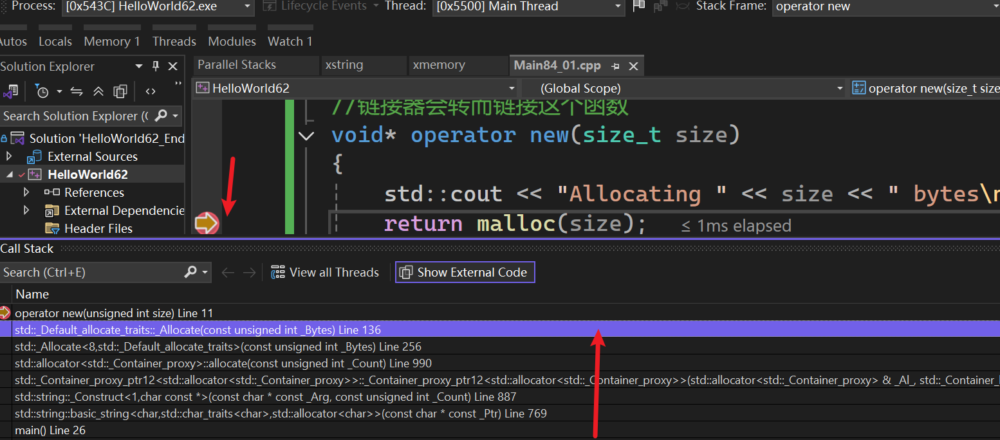
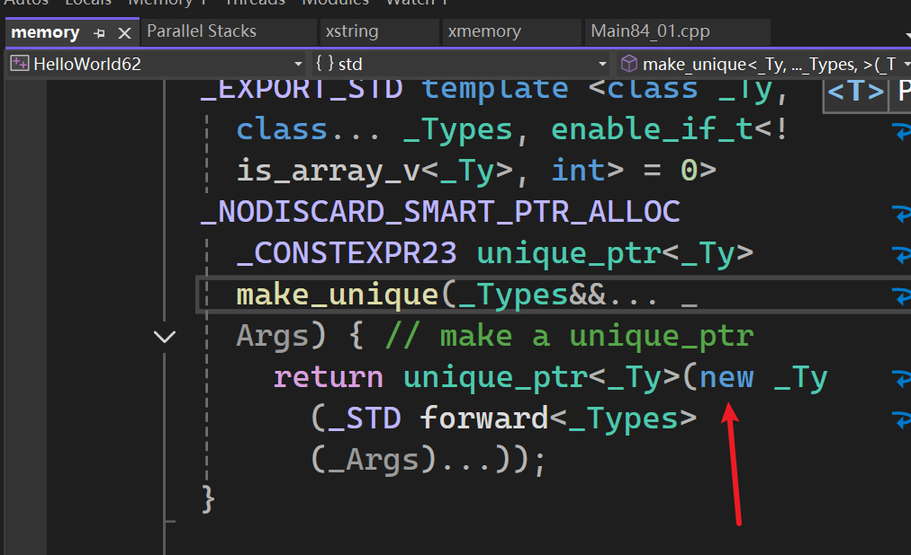
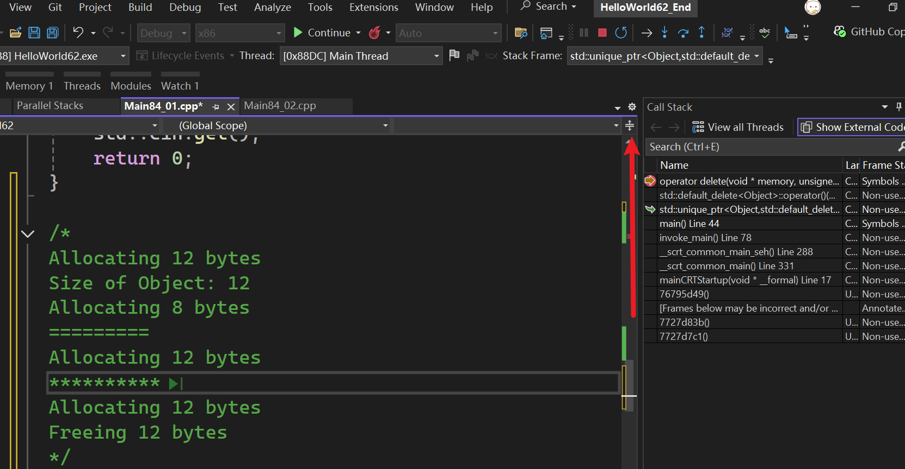

#  核心原理：重载全局 `new`

- ==原理==：在 C++ 中，当你写 `new Object()` 时，它实际上调用了一个名为 `operator new` 的全局函数。
- ==自定义拦截==：你可以重写这个函数。编译器会优先使用你的自定义版本，而不是标准库提供的版本。
- ==代码演示==：
  
```cpp
void* operator new(size_t size) {
    std::cout << "Allocating " << size << " bytes\n";
    return malloc(size); // 最终还是要调用底层的内存分配
}
```
#  对应的 `delete` 重载

- ==对称性==：重载了 `new` 就必须重载 `delete`，否则可能会导致内存管理逻辑不一致。
- ==代码实现==：
    
```cpp
    void operator delete(void* memory, size_t size) {
        std::cout << "Freeing " << size << " bytes\n";
        free(memory);
    }
```

- ==注意==：Cherno 提到现代 C++ 建议使用带 `size` 参数的 `delete` 版本，以便更精准地追踪。


#  实战：追踪总分配量 (The Tracker)

- ==引入单例/全局状态==：为了统计数据，Cherno 定义了一个简单的结构体来存储 `TotalAllocated` 和 `TotalFreed`。
- ==逻辑==：在 `new` 里面让计数器增加，在 `delete` 里面减少。
- ==演示==：通过创建一个 `std::string` 或自己的 `Entity` 类，观察控制台实时打印出的分配字节数。

# 完整代码  


```cpp
#ifdef LY_EP84

#include <iostream>  
#include <memory>

struct AllocationMetrics
{
	uint32_t TotalAllocated = 0;
	uint32_t TotalFreed = 0;
	
	uint32_t CurrentUsage()
	{
		return TotalAllocated - TotalFreed;
	}
};

static AllocationMetrics s_AllocationMetrics;

//重写operator new 的全局函数，
//链接器会转而链接这个函数
void* operator new(size_t size)
{
	s_AllocationMetrics.TotalAllocated += size;
	std::cout << "Allocating " << size << " bytes\n";
	return malloc(size);
}

//重写特定函数签名来获取特定的释放大小的信息
void operator delete(void* memory, size_t size)
{

	s_AllocationMetrics.TotalFreed += size;
	std::cout << "Freeing " << size << " bytes\n";
	free(memory);
}

struct Object
{
	int x, y, z;
};

/*
内存使用情况
*/
static void PrintMemoryUsage()
{
	std::cout << "Memory Usage: " << s_AllocationMetrics.CurrentUsage() << " bytes.\n";
}


int main()
{
	PrintMemoryUsage();
	Object* obj = new Object;

	//正好12字节，在 C++ 中，类/结构体本身不包含任何运行时开销。
	std::cout << "Size of Object: " << sizeof(Object) << std::endl;

	PrintMemoryUsage();
	std::string s = "Cherno";

	PrintMemoryUsage();
	std::cout << "=========" << std::endl;

	//这行代码仍会分配12字节
	std::unique_ptr<Object> obj1 = std::make_unique<Object>();
	PrintMemoryUsage();
	std::cout << "**********" << std::endl;

	{
		std::unique_ptr<Object> obj =
			std::make_unique<Object>();
		PrintMemoryUsage();
	}

	PrintMemoryUsage();

	std::cin.get();
	return 0;
}

/*
Memory Usage: 0 bytes.
Allocating 12 bytes
Size of Object: 12
Memory Usage: 12 bytes.
Allocating 8 bytes
Memory Usage: 20 bytes.
=========
Allocating 12 bytes
Memory Usage: 32 bytes.
**********
Allocating 12 bytes
Memory Usage: 44 bytes.
Freeing 12 bytes
Memory Usage: 32 bytes.
*/
#endif
```

## new

- 设置断点在operator new函数里面的`return malloc(size);`    
- （Debug模式下）第二次进入断点，即`std::string s = "Cherno";`后进去，调用栈如下（从下往上）


  

- 进入断点后查看`std::make_unique<Object>()`的内存分配  
  
  
- 通过查看调用栈（Call Stack），确切追溯这些内存分配的来源  

## free 

查看调用栈  




#  避坑指南：无限递归与 `std::cout`

- ==致命陷阱==：如果你在 `operator new` 里面使用了 `std::cout`，而 `std::cout` 内部又使用了 `new` 来分配缓冲区，就会导致==无限递归==并造成堆栈溢出（Stack Overflow）。
- ==解决方案==：在追踪逻辑中尽量避免使用复杂的、会分配内存的对象。这也是为什么 Cherno 之后建议将打印逻辑放在 `main` 函数中，而不是 `new` 函数体内。

#  11:31 - 结尾 | 实际应用场景

- ==性能调试==：通过追踪，你可以发现哪些地方产生了意外的拷贝（比如 `std::vector` 的扩容，或者错误的字符串赋值）。
- ==内存泄漏检查==：在程序结束前打印 `TotalAllocated - TotalFreed`，如果结果不为 0，说明有内存泄漏。

