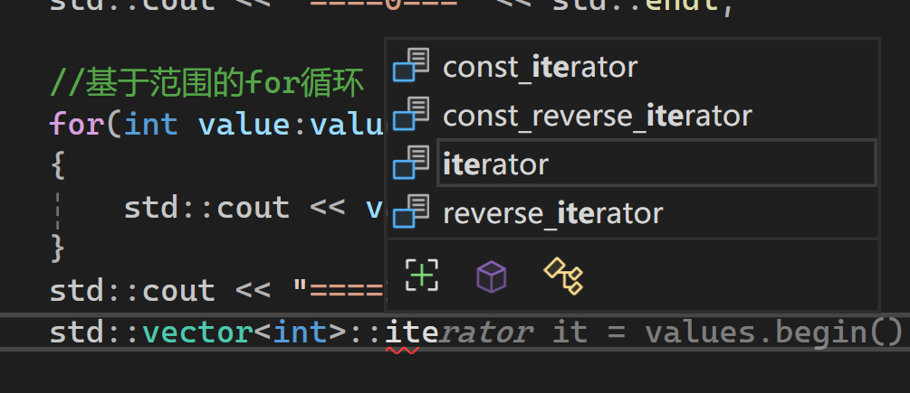

- ==迭代器的基本定义==迭代器是一个对象，其行为类似于指针，用于遍历容器中的元素。它提供了一种统一的方法来访问不同类型容器（如数组、链表、树）中的数据，而无需了解容器的底层实现。
- ==为什么需要迭代器？==不同的容器有不同的存储结构（==内存连续或不连续==）。迭代器将“遍历数据”这一行为抽象化，使得开发者可以使用相同的语法（如 `++` 或 `*`）来处理各种复杂的集合。
- ==核心概念：begin() 与 end()==
    - ==`begin()`==：返回指向容器中第一个元素的迭代器。
    - ==`end()`==：返回指向容器中==最后一个元素之后==位置的迭代器（即“越界”位置）。这用于标记遍历的结束。
- ==迭代器的基本操作==演示了如何使用迭代器进行手动遍历：
    - 使用 `*it`（解引用）获取当前元素的值。
    - 使用 `++it` 将迭代器移动到下一个元素。
    - 使用 `it != map.end()` 作为循环终止条件。
- ==现代 C++ 中的简化写法 (Range-based for loop)==解释了基于范围的 `for` 循环（如 `for (auto& v : values)`）在底层其实就是通过调用容器的 `begin()` 和 `end()` 迭代器来实现的。
- ==在不同容器中的应用（以 std::map 为例）==演示了由于 `std::map` 不是连续内存空间，不能使用下标 `[i]` 遍历，此时迭代器是访问元素的唯一标准方式。对于 `map`，迭代器指向的是 `std::pair` 类型。

# 简单例子 

std::vector有几种迭代器：  

    

```cpp
#ifdef LY_EP86

#include <iostream>     
#include <vector>

//无序映射（哈希表）
#include <unordered_map>

int main()
{
	std::vector<int> values = { 1,2,3,4,5 };
	for (int i = 0; i < values.size(); i++)
	{
		//没有索引系统的集合类型，无法使用下标访问元素
		std::cout << values[i] << std::endl;
	}
	std::cout << "====0===" << std::endl;

	//基于范围的for循环
	for (int value : values)
	{
		std::cout << value << std::endl;
	}
	std::cout << "====1===" << std::endl;

	//values.end()返回一个超出可接受范围的迭代器对象，是个无效迭代器，是最后一个元素的下一个元素，所以不能访问它指向的元素
	//当你修改容器（添加、删除或重新分配内存）时，指向该容器元素的迭代器可能会变得像“野指针”一样，指向错误的内存地址。
	for (std::vector<int>::iterator it = values.begin(); it != values.end(); it++)
	{
		//像对待指针那样，进行解引用
		//因为实际的迭代器类里实现了类似星号的解引用操作符重载 
		std::cout << *it << std::endl;
	}
	std::cout << "====2===" << std::endl;
	using ScoreMap = std::unordered_map<std::string, int>;
	ScoreMap map;
	using ScoreMapConstIter = ScoreMap::const_iterator;
	map["Cherno"] = 5;
	map["c++"] = 2;

	//不修改容器中的元素时，使用const_iterator
	for (ScoreMapConstIter it = map.begin(); it != map.end(); it++)
	{
		//*it是一个pair对象，first成员是key，second成员是value
		//auto&，引用，不会实际复制值
		//迭代器指向的是 std::pair 类型
		auto& key = it->first;
		auto& value = it->second;
		std::cout << key << " " << value << std::endl;
	}
	std::cout << "====3===" << std::endl;
	//kv的类型: std::pair<const std:;string,int> &kv
	for (auto& kv : map)
	{
		auto& key = kv.first;
		auto& value = kv.second;
		std::cout << key << " " << value << std::endl;

	}
	std::cout << "====4===" << std::endl;

	//c++17才支持
	//C++17 的结构化绑定 (Structured Bindings)
	for (const auto& [key,value] : map)
	{ 
		std::cout << key << " " << value << std::endl;

	}

	std::cin.get();
	return 0;;
}
/*
1
2
3
4
5
====0===
1
2
3
4
5
====1===
1
2
3
4
5
====2===
Cherno 5
c++ 2
====3===
Cherno 5
c++ 2
====4===
Cherno 5
c++ 2
*/
#endif
```


