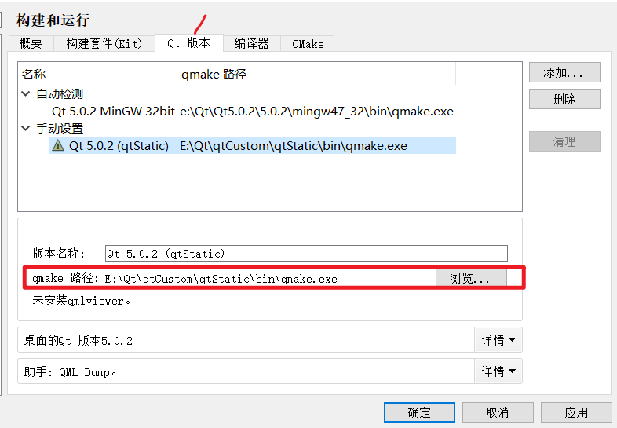
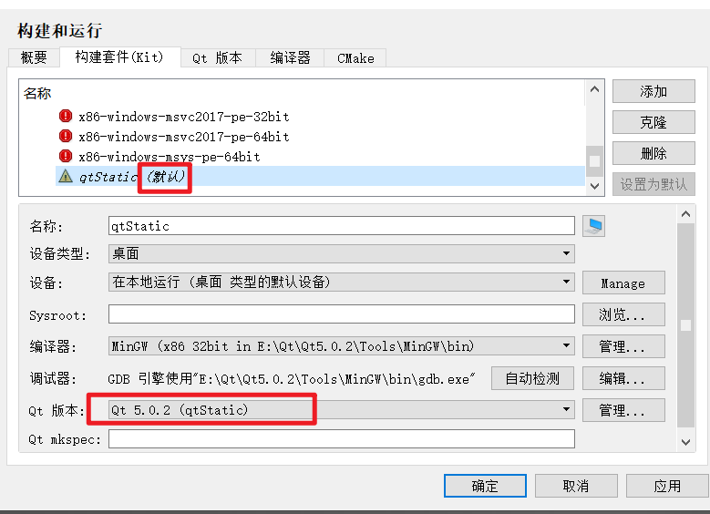
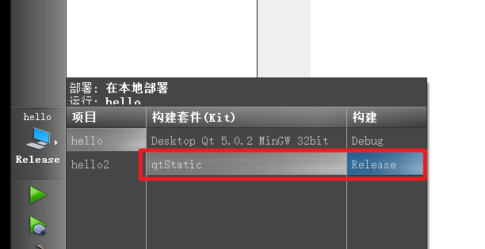

# 下载(视频所用版本) 

```
===弃用===
- MinGW(4.4): https://www.123912.com/s/u5pSjv-32uAH?提取码:M27Z  
	- 要记得设置环境变量
- qt库： https://download.qt.io/archive/qt/4.7/qt-win-opensource-4.7.0-mingw.exe  
- Qt Creator： https://download.qt.io/archive/qtcreator/2.0/qt-creator-win-opensource-2.0.1.exe  
====使用5.0.2====
qt+mingw--> https://download.qt.io/archive/qt/5.0/5.0.2/qt-windows-opensource-5.0.2-mingw47_32-x86-offline.exe
源码-->  https://download.qt.io/archive/qt/5.0/5.0.2/single/qt-everywhere-opensource-src-5.0.2.zip
perl-->  https://strawberryperl.com/download/5.16.3.1/strawberry-perl-5.16.3.1-32bit-portable.zip
=====在线版5.15======
https://mirrors.tuna.tsinghua.edu.cn/qt/official_releases/online_installers/qt-online-installer-windows-x64-online.exe
- .\qt-online-installer-windows-x64-online.exe  --mirror https://mirrors.ustc.edu.cn/qtproject 
- Archive中选择5.15及6.8
- 安装内容：MinGW,Android,QtCharts,QtMultimedia,QtQuich3D,QtShaderTools
=====其他=======
- qt库(带MinGW和qtCreator)： https://download.qt.io/new_archive/qt/5.2/5.2.1/qt-opensource-windows-x86-mingw48_opengl-5.2.1.exe
- MinGW(4.8,不需要了，qt库自带): https://sourceforge.net/projects/mingw-w64/files/Toolchains%20targetting%20Win32/Personal%20Builds/mingw-builds/4.8.1/threads-posix/sjlj/i686-4.8.1-release-posix-sjlj-rt_v3-rev2.7z/download  (4.8.1)
```

# 编译静态编译的qmake
- 下载源码 
- 路径不能有奇奇怪怪的符号（.-_ 之类） 
- (弃)修改 `E:\Qt\qtSrc\qtbase\mkspecs\win32-g++\qmake.conf`,修改`QMAKE_LFLAGS = -static -enable-stdcall-fixup -Wl,-enable-auto-import -Wl,-enable-runtime-pseudo-reloc`(仅添加`-static`) 
## 目录结构
```shell
mkdir "E:\Qt\qtCustom\buildQtStatic" #/p
mkdir "E:\Qt\qtCustom\qtStatic" 
mkdir "E:\Qt\qtCustom\qtSrc"  
#E:\Qt\qtCustom下
				- buildQtStatic #(新建的)编译时切换到这个目录
				- qtSrc #源码
				- qtStatic #(新建的)install目录
```
## 静态编译
我用的是视频0087集的办法，也可以用 `https://www.cnblogs.com/atggg/p/16878575.html`试试 
```shell
#修改文件 E:\Qt\qtCustom\qtSrc\qtbase\mkspecs\win32-g++\qmake.conf
#末尾添加
#======lyadd======
QMAKE_LFLAGS += -static -static-libgcc -static-libstdc++
QMAKE_CFLAGS += -static
QMAKE_CXXFLAGS += -static
```

编译时不加上面这几行修改qmake.conf的原因
  


```shell
#(很重要，在src外，不然编译时一堆错误)
cd "E:\Qt\qtCustom\buildQtStatic" 
"E:\Qt\qtCustom\qtSrc\configure.bat" -static -debug-and-release -platform win32-g++ -prefix "E:\Qt\qtCustom\qtStatic"  -opensource -confirm-license -opengl desktop -nomake  examples -nomake tests -nomake demos 
#-debug-and-release linux默认
#-release windows默认
#-debug

# 编译（-j4 表示 4 线程加速 ）
mingw32-make  -j4    
# 安装到指定目录
mingw32-make -j4 install 
```

## 动态编译
```shell
configure -platform win32-g++ -shared -release
```
## qtCreator
- Qt Creator → 工具 (Tools) → 选项 (Options) → Kits
	- qmake.exe
	  
	- Qt 5.0.2 (Static)  
	  
	- 新建项目  
	  
		- 如果两个都选择了，编译的时候也可以选择  
		  
